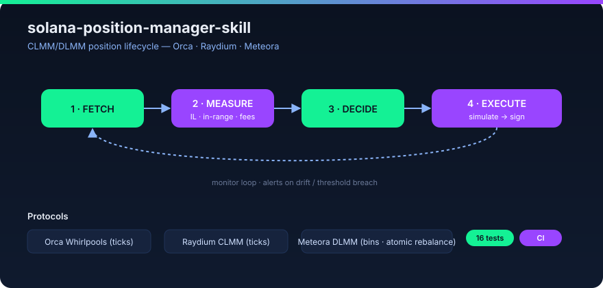

# solana-position-manager-skill


A Claude Code / Codex skill addon for **managing concentrated-liquidity (CLMM/DLMM) positions on Solana** across **Orca Whirlpools**, **Raydium CLMM**, and **Meteora DLMM** — with the constant-product baselines (**Raydium CPMM**, **Meteora DAMM v2**) scope-clarified as the v2 (λ=1) case.

<p align="center"></p>

It extends the core [`solana-dev-skill`](https://github.com/solanabr/solana-dev-skill) with a focused discipline that nobody in the kit covers end-to-end: the **lifecycle of an LP position** — from fetching it, to measuring impermanent loss, to detecting out-of-range drift, to deciding and safely executing a rebalance, to monitoring it on a schedule.

> Solana AI Kit bounty submission. Built to slot cleanly into the standard kit.

## The problem it solves

Concentrated liquidity lets LPs pick a price range and earn far more fees than v2 AMMs — but it turns liquidity providing into an **active management job** that most builders get wrong:

- Positions silently drift **out of range** and stop earning fees (no alerts).
- **Impermanent loss** is larger and non-obvious in concentrated ranges; nobody measures it properly.
- "Rebalancing" is done by feel — too often (burning gas), or too late (missing fees).
- Three protocols with **different models** (Orca/Raydium = tick ranges, Meteora = discrete bins) and different SDKs mean every script is bespoke.

This skill gives an agent the **measurable, repeatable** version: real IL math, current SDK calls, alert thresholds, and rebalance heuristics with the tradeoffs spelled out.

## Architecture

```
                    ┌─────────────────────────────────────────┐
                    │  skill/SKILL.md  (routing hub, lazy)     │
                    └───────────────┬─────────────────────────┘
            measure │               │ decide            │ execute
   ┌────────────────┼───────────────┼───────────────────┼───────────────┐
   ▼                ▼               ▼                   ▼               ▼
whirlpools.md   raydium-clmm.md  meteora-dlmm.md   impermanent-loss.md range-alerts.md
   │                │               │                   │               │
   └────────────────┴───────────────┴────────┬──────────┴───────────────┘
                                            ▼
                                      rebalance.md ──► backtest.md
                                            │
                                            ▼
                                  rules/safe-rebalance.md
```

The skill references the core `solana-dev-skill` for program/CLI/testing basics and only loads the file relevant to the current step.

## Verified program IDs & SDK (2026)

Every program ID and SDK function below is checked against the official SDK repos/docs (see `skill/resources.md` for sources); unverified items are marked there, not invented.

| Protocol | Program ID | SDK (2026) | Position model |
|---|---|---|---|
| Orca Whirlpools | `whirLbMiicVdio4qvUfM5KAg6Ct8VwpYzGff3uctyCc` | `@orca-so/whirlpools` 8.0.1 (+ `_client` 7.0.0, `_core` 3.1.0); Rust `orca_whirlpools` 8.0.0 | tick range, 216-byte `Position`; `resetPositionRangeInstructions` shifts range in place |
| Raydium CLMM | mainnet `CAMMCzo5YL8w4VFF8KVHrK22GGUsp5VTaW7grrKgrWqK` / devnet `DRayAUgENGQBKVaX8owNhgzkEDyoHTGVEGHVJT1E9pfH` | `@raydium-io/raydium-sdk-v2` 0.2.55-alpha; Rust CPI `raydium_amm_v3` (git) | NFT-bound `PersonalPositionState`; range change = close + open |
| Meteora DLMM (`lb_clmm` 0.12.0) | `LBUZKhRxPF3XUpBCjp4YzTKgLccjZhTSDM9YuVaPwxo` | `@meteora-ag/dlmm` 1.9.10; Rust `commons` 0.3.3 | discrete bins; **atomic `rebalancePosition`** (claim+remove+resize+add in one ix) |
| Raydium CPMM (constant-product) | `CPMMoo8L3F4NbTegBCKVNunggL7H1ZpdTHKxQB5qKP1C` | `@raydium-io/raydium-sdk-v2` 0.2.55-alpha (`raydium.cpmm`) | fungible LP, **no concentration** — v2 baseline (λ=1) |
| Meteora DAMM v2 (constant-product) | `cpamdpZCGKUy5JxQXB4dcpGPiikHawvSWAd6mEn1sGG` | `@meteora-ag/cp-amm-sdk` 1.4.4 (class `CpAmm`) | NFT positions, no range — fetch/fees/claim in scope |

## How it compares to kit skills

| | This skill | `ext/sendai` (DeFi) | `ext/helius` (infra) | `ext/jupiter` (swaps) | `ext/meteora` (SDK) |
|---|---|---|---|---|---|
| LP position lifecycle | ✅ end-to-end | ❌ primitives | ❌ RPC/DAS | ❌ swaps/lend | snippets only |
| Impermanent-loss math | ✅ tested | ❌ | ❌ | ❌ | ❌ |
| Out-of-range alerts | ✅ | ❌ | ❌ | ❌ | ❌ |
| Rebalance decision | ✅ (HOLD/WIDEN/MOVE/WITHDRAW) | ❌ | ❌ | ❌ | ❌ |
| 5 Solana AMM protocols (3 concentrated + 2 constant-product) | ✅ | partial | ❌ | ❌ | 1 (DLMM) |

No existing kit skill covers the LP position lifecycle; closest references are swap/SDK-snippet level.

## When NOT to use this skill

- **Spot trading / swaps** — use `jup-ag/agent-skills`, not a position manager.
- **Perpetuals / futures** — CLMM/DLMM ranges are spot AMM mechanics; perps are a different product.
- **Lone staking / single-sided lending** — no range, no IL of this kind.
- **Set-and-forget full-range v2 LP** — IL is v2-style (λ=1); a position manager adds little. Full-range is the degenerate case of every formula here.
- **Executing rebalances blind** — this skill always simulates first (`rules/safe-rebalance.md`); if you want auto-execution without sign-off, that is explicitly out of scope.

## Verification

| Check | Result |
|---|---|
| `python tests/test_il.py` | 16 / 16 IL-math tests pass (incl. v2-amplification cross-check) |
| `python tests/test_fetch.py` | 10 / 10 position-decode + analysis tests pass (+ opt-in live-RPC test) |
| `python tests/test_eval.py` | quantified eval: with-skill **24/24** vs fair ablation baseline **16/24**; **0/12** false-positive triggers (refs derived independently of the skill's eval path) |
| `npm run typecheck` (`examples/dlmm`) | DLMM TS example compiles clean vs real `@meteora-ag/dlmm` (`tsc --noEmit`) |
| `./validate.sh` | structure + intra-skill links: all pass |
| CI (`.github/workflows/validate.yml`) | validate + IL + decode + **eval** + **tsc** + installer dry-run on every push/PR |
| Live site | https://yusizer.github.io/solana-position-manager-skill/ (GitHub Pages, `docs/index.html`) |
| Program IDs | verified against `declare_id!` / SDK docs in each protocol's repo |
| IL formulas | verified by reduction to v2 (full-range) + worked numeric examples |

## Default stack (2026)

| Layer | Default |
|---|---|
| RPC | Helius (free tier, DAS + parsed history) — read-only for monitoring |
| SDK | `@orca-so/whirlpools` 8.x, `@raydium-io/raydium-sdk-v2` 0.2.55, `@meteora-ag/dlmm` 1.9.10 |
| IL math | pure-Python `examples/il_math.py` (zero deps) — also implemented in `examples/dlmm` TS |
| Price (USD) | Jupiter Price API v3 / Birdeye / GeckoTerminal |
| Rebalance trigger | drift > 0.95 (RED) or feeRatio < \|IL\| (`skill/range-alerts.md`) |
| Monitoring | cron / GitHub Actions / in-process; Claude Code `Stop` hook (`skill/hooks.md`) |

## Skill files

| File | What it gives the agent |
|---|---|
| `skill/SKILL.md` | Entry point. Routes to the right file by intent. |
| `skill/whirlpools.md` | Orca Whirlpools: SDK, program ID, position layout, fetch, in-range check, fees, rebalance tx order. |
| `skill/raydium-clmm.md` | Raydium CLMM: Position NFT layout, SDK, tick math, in-range, fees, rebalance. |
| `skill/meteora-dlmm.md` | Meteora DLMM: bin model, dynamic fees, position layout, SDK, in-range by active bin, rebalance. |
| `skill/meteora-damm-v2.md` | Meteora DAMM v2: constant-product, NFT positions, `CpAmm` SDK — fetch/fees/claim; why range/rebalance don't apply (λ=1). |
| `skill/raydium-cpmm.md` | Raydium CPMM: constant-product, fungible LP — scope note (λ=1 full-range case). |
| `skill/impermanent-loss.md` | Concentrated-IL math, worked example, how it differs from v2 IL, how to compute it from tick/price. |
| `skill/benchmarks.md` | Verified IL-by-range-width table (λ amplification) + range-choice decision shortcut. |
| `skill/range-alerts.md` | Out-of-range detection, distance-from-tick thresholds, fee-to-principal ratio alerts. |
| `skill/rebalance.md` | Rebalance decision heuristics: widen vs move vs withdraw; gas-vs-fees tradeoff; anti-over-rebalance. |
| `skill/backtest.md` | Fee APR, IL, return-vs-HODL; historical tick/fee data sources; evaluation metrics. |
| `skill/monitoring.md` | Scheduled fetch + alert wiring (Helius/RPC, webhooks, cron). |
| `skill/hooks.md` | Opt-in Claude Code `Stop` hook for auto-alerts on out-of-range drift. |
| `skill/resources.md` | SDK packages, program IDs, official docs, data providers. |

## Agents

| Agent | Model | Purpose |
|---|---|---|
| `position-analyst` | opus | Deep position analysis: IL computation, range strategy, rebalance *decision*. |
| `rebalance-engineer` | sonnet | SDK transaction execution: fetch → quote → simulate → sign → confirm. |

## Commands

| Command | Purpose |
|---|---|
| `/check-positions <wallet>` | List all CLMM/DLMM positions for a wallet with in-range status and accrued fees. |
| `/il-report <position>` | Full impermanent-loss report vs HODL for one position. |
| `/rebalance-suggest <position>` | Rebalance recommendation with reasoning and expected fee/IL delta. |
| `/monitor-setup` | Scaffold a scheduled monitor + alert for out-of-range drift. |

## Rules (auto-loading)

- `rules/safe-rebalance.md` — never execute without simulate/dry-run; minimum-cooldown between rebalances; position-size guards.
- `rules/position-data-freshness.md` — require fresh tick/price (<60s) before measuring IL; reject stale quotes.

## Installation

### Automated (defaults)

```bash
curl -fsSL https://raw.githubusercontent.com/yusizer/solana-position-manager-skill/main/install.sh | bash
```

Installs to `~/.claude/skills/solana-position-manager/` and appends the skill reference to `~/.claude/CLAUDE.md`. Assumes the core `solana-dev-skill` is already installed (the kit installs it by default).

### Interactive

```bash
./install-custom.sh
```

Choose install location (`~/.claude/skills/` or `./.claude/skills/` for the current project) and whether to touch `CLAUDE.md`.

### Manual

```bash
git clone https://github.com/yusizer/solana-position-manager-skill.git
cp -r solana-position-manager-skill/skill ~/.claude/skills/solana-position-manager
cp -r solana-position-manager-skill/agents ~/.claude/agents/   # optional
cp -r solana-position-manager-skill/commands ~/.claude/commands/ # optional
```

## Examples & tests (the math is executable, not just prose)

This skill ships runnable artifacts so the IL math and installer are **tested**, not asserted:

- `examples/il_math.py` — pure-Python implementation of the concentrated-IL formulas in `skill/impermanent-loss.md` (zero deps).
- `examples/il_calc.py` — CLI calculator. `python examples/il_calc.py --pa 140 --pb 210 --p0 170 --p 200 --principal 10000 --fees 320`.
- `examples/fetch_position.py` — read-only Solana RPC decoder: `getAccountInfo` + decode the verified 216-byte Orca `Position` layout (stdlib only, no npm), then in-range / drift / IL. **Live-RPC capable**; tests decode an offline fixture (CI-safe) plus an opt-in live test (`SOLANA_RPC_URL` + `SOLANA_TEST_POSITION`). `python examples/fetch_position.py --offline --current-tick 0 --open-tick 0 --json`.
- `examples/dlmm/` — runnable TypeScript reference on the real `@meteora-ag/dlmm` SDK: `monitor.ts` (read-only out-of-range alerts) + `rebalance.ts` (atomic rebalance, simulate-only). `tsc --noEmit` clean; CI typechecks it. See `examples/dlmm/README.md`.
- `hooks/range-alert-hook.sh` — opt-in Claude Code `Stop` hook (see `skill/hooks.md`).
- `tests/test_il.py` + `tests/test_fetch.py` — 26 unit tests total (16 IL math + 10 position decode + CLI smoke; incl. opt-in live-RPC). Plus `tests/test_eval.py` — quantified with-skill vs baseline eval suite. `python tests/test_il.py && python tests/test_fetch.py && python tests/test_eval.py`.
- `.github/workflows/validate.yml` — CI runs `validate.sh` + IL + decode + **eval** + DLMM **tsc** typecheck + an installer dry-run on every push/PR.
- `.github/workflows/deploy-pages.yml` — deploys a static landing page (`docs/index.html`) to GitHub Pages on push to `main`.
- `docs/EVAL.md` — quantified evaluation report (methodology + per-task results). `docs/index.html` — live landing page.
- `validate.sh` — structure, required-files, and intra-skill link check.
- `assets/architecture.svg` + `assets/preview-card.svg` — diagrams for docs/PRs.

```bash
./validate.sh               # structure + links
python tests/test_il.py     # 16 IL-math tests
python tests/test_eval.py   # quantified eval (with-skill vs baseline)
```

## Development workflow

- Fork → branch `feat/<topic>` → PR.
- Keep `.md` files **token-efficient**: SKILL.md stays a router; push detail into the focused files.
- Every SDK call in a `.md` must use **real, current** function names. If an API changes, update the file and note the version in `resources.md`.
- Run `./validate.sh` and `python tests/test_il.py` before pushing. CI enforces both.

## License

MIT © 2026 yusizer
